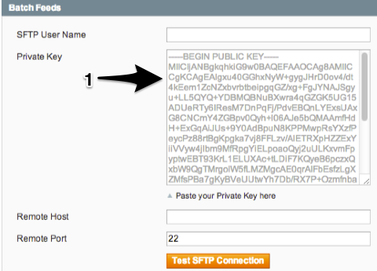
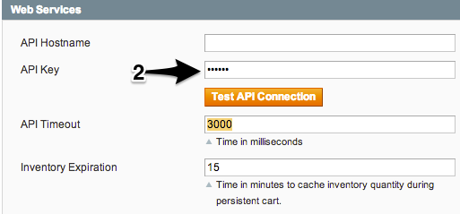
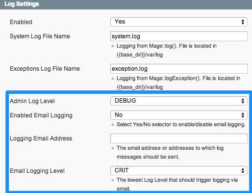

#Retail Order Management (ROM) Magento Extension Troubleshooting Guide

- [Intended Audience](#intended-audience)
- [System Notes and Limitations](#system-notes-and-limitations)
  - [Combinations of Services](#combinations-of-services)
  - [ROM Payments](#rom-payments)
  - [ROM and Magento Order Status](#rom-and-magento-order-status)
  - [Product Attribute Sets](#product-attribute-sets)
  - [Gift Wrapping/ Messaging](#gift-wrapping-messaging)
- [Common Problems - Configuration](#common-problems---configuration)
  - [SFTP Credentials](#sftp-credentials)
  - [Web Services](#web-services)
  - [XML Configuration](#xml-configuration)
  - [Payments - Enabled, But Payment Bridge Disabled/ Not Configured](#payments---enabled-but-payment-bridge-disabled-not-configured)
  - [Order Create Retry](#order-create-retry)
  - [Getting the Client IP](#getting-the-client-ip)
- [Troubleshooting: Using the System and Exception Logs](#troubleshooting-using-the-system-and-exception-logs)
  - [ROM Extended Magento Logging](#rom-extended-magento-logging)
  - [Reading the System Log](#reading-the-system-log)
    - [Log Format](#log-format)
    - [Monitoring and Viewing Logs](#monitoring-and-viewing-logs)
  - [Log Messages: Examples](#log-messages-examples)
  - [Reading the Exception Log](#reading-the-exception-log)


##Intended Audience
The intended audience for this guide is systems integrators with extensive experience with Magento and XML programming experience.

Knowledge of Magento Administrative Configuration functions, and also of Magento XML Configuration Files, is assumed in this document.

---

##System Notes and Limitations

###Combinations of Services
While the ROM Extension is an interrelated set of modules, some modules can be disabled independently.

You can disable the following modules:

1. Customer Service
2. Address Validation
3. Payments

You can disable Transactional Emails by configuring the ROM Extension to use the Magento Transactional Email handler instead of the eBay Enterprise Email.


###ROM Payments
When the ROM Payment Module is enabled, all other Magento Payment Services are automatically disabled.

Changing a Magento webstore from a non-ROM Payment System to a ROM Payment system should be carefully reviewed to ensure compatibility with returns, credits, payment reversals, etc.

###ROM and Magento Order Status
The ROM Extension overrides Magento Order Status to ensure synchronization with eBay Enterprise ROM Services. As such, it is not compatible with any other extension that also manipulates Order Status.

Additionally, extensions depending upon Order Status may not behave as expected. ROM Service offers many more types of status than the standard Magento set.

###Product Attribute Sets
Magento does not support changing an Attribute Set of a product once it's been set. We _strongly_ discourage changing a Product's Attribute Sets via Product Import Feeds. Unpredictable results will likely occur.

###Gift Wrapping/ Messaging
The ROM Extension fully supports product level gift messaging and gift wrapping.

The extension does not support order level gift message and wrapping. These options must be disabled (```System->Configuration->Sales->Gift Options```).

Make sure Enterprise Giftwrapping is imported under (```Sales->Gift Wrapping```).
Also ensure the two newly added field are available: Sku and Tax Class.

---
##Common Configuration Problems
Configuration issues are the most common cause of problems.

### SFTP Credentials
The private key must be pasted as-is, with newlines. Note that the Public Key (Fig. 1) is displayed as soon as the private key is correctly installed. Use the Test SFTP Connection button to ensure you are able to connect.



### Web Services:
The API Key (Fig. 2) is obscured, so the only way to really know if it is correct is to use the Test API Connection.



### XML Configuration:
There are several XML configuration files installed to ```app/etc``` which control various aspects of the extensions' behavior. For complete details, consult [Installation and Configuration of the eBay Enterprise Retail Order Management Magento Extension](INSTALL.md).

You will need:

* ```rom.xml```, which contains core configuration details.
* _One of_: ```productexport.xml``` (Using Magento as a Product Information Manager ) ```productimport.xml``` (Magento receives feeds from eBay Enterprise Retail Order Management Service). Unpredictable results will occur if you have _both_ of these files installed.

You may need:

* ```ordercustomattributes.xml``` If you are implementing any custom attributes for _orders_. Consult [Mapping Order Create Custom Attributes](ORDER_CUSTOM_ATTRIBUTES.md) for full details.

### Payments - Enabled, But Payment Bridge Disabled/ Not Configured

There are two places that require configuration and enabling for ROM Extension Payments:

1. System Configuration->Retail Order Management->Payments
2. System Configuration->Payment Methods->Payment Bridge

It is possible to Enable ROM Payments Credit Cards and not enable Payment Bridge.


#### Ensure that Payments are enabled (Fig. 3) ...


#### ... and click through to enable and configure Payment Bridge (Fig. 4)


### Order Create Retry

The cron job ```eb2c_order_create_retry``` attempts to resend OrderCreateRequests for orders that were successfully processed through payment, but for some reason, had not been submitted to the OMS.

If the eb2c_order_create_retry is unable to retrieve the original OrderCreateRequest (which is stored along with the order), it will log a message at the _warn_ level, and leave the order status unchanged.

This means that the eb2c_order_create_retry job will continue to try to resubmit the order. Manual intervention will be needed to resolve the issue.

The warning message will look something like this:

```2014-08-13T17:28:21+00:00 WARN (4): [ EbayEnterprise_Eb2cOrder_Model_Create::retryOrderCreate ]: Original OrderCreateRequest not found: 00054100000031```

In this example, Magento Order 00054100000031 will need manual attention in order to be processed.

### Getting the Client IP

The Fraud Detection module requires the client IP address. Compliant browsers send this in the `REMOTE_ADDR` header, so if the client is connected directly to the web server you do not need to do anything; however, in a load balancer/reverse proxy setup you may need to set `remote_addr_headers` in local.xml to get the right value from the reverse proxy. This is also documented in app/etc/local.xml.additional, included with Magento.

```xml
<config>
    <global>
        <remote_addr_headers>
            <header1>HTTP_X_REAL_IP</header1>
            <header2>HTTP_X_FORWARDED_FOR</header2>
        </remote_addr_headers>
    </global>
</config>
```

The above will cause Magento to look first in the specified HTTP request headers before falling back to `REMOTE_ADDR`.

---

##Troubleshooting: Using the System and Exception Logs
Troubleshooting typically involves reviewing configuration options and occasionally enabling logging in order to review system and exception logs.

By default, Magento ships with logging turned _off_. During System Implementation, setting the Log Level to ```INFO``` should suffice. ```DEBUG``` is intended for system developers, and is extremely verbose - it may introduce more noise into the logs than desired for most needs.


###ROM Extended Magento Logging
The Magento ROM Extension provides expanded logging capabilities to help diagnose configuration issues and other problems. The image below illustrates the additional options. These options and their settings are  covered in the document _Installation and Configuration of the eBay Enterprise Retail Order Management Magento Extension_.

The System logs messages based on a Log Level set in the configuration. Depending upon the configuration, the system will log when it encounters an error, or when it issues a request to an outside services, when it receives a message, etc.



###Reading the System Log
As the ROM Extension interacts with continuously evolving external systems, it is difficult to quantify every possible message that may be received. Instead, we rely on the external systems to return actionable error messages, which are placed into the System Log.

The actual messages may change over time. However, armed with a general knowledge of the logs and their formats, troubleshooting most problems should be straightforward.

In this section, we will review:

* _Log Format_ the general format of a log message
* _Monitoring_ the system from the command line
* _Examples_ some specific log examples to give you an idea of real-world messages

> **_IMPORTANT!_** During system testing you should monitor requests and responses to ensure that the remote host is correctly configured for your installation. The ROM Extension requires corresponding configuration both in Magento and on the remote host. The remote host will provide helpful messages that are needed to resolve configuration issues.


####Log Format
The system log is a plain text file, with the general format of:

```
YYYY-MM-DDThh:mm:ss+TZ LOGLEVEL (n): [Module_Class::Method] Message
```
where:

* The first column is the timestamp of the message.
* ```LOGLEVEL (n)``` Indicates the severity of the message, along with the numeric value of that severity. The higher the log value, the less severe the message.
* ```[Module_Class(optional ::Method)]``` indicates which Module emitted the entry
* ```Message``` is the text of the log message - which can span multiple lines

####Monitoring and Viewing Logs
As the log file is a plain text file, any editor will be able to peruse it. You can also

```
tail -f log/system.log
```

to watch the log and monitor entries near realtime.

----
### Log Messages: Examples
In the section, we will examine logging for two sets of interactions with the Inventory ROM Services. The intent is to provide you with a general sense of how messages are presented, and what is logged.

Of note:

* Messages can span multiple lines.
* Some XML requests or responses can be large; it will help to have a reliable XML formatter into which you can paste XML log message that are difficult to parse by eye.

####Example: Inventory Service Requests and Response

#####Quantity

* Request: this is an outbound Quantity Request, issued when an item is added to cart:

```
2014-06-02T19:27:21+00:00 INFO (6): [EbayEnterprise_Eb2cCore_Model_Api] Validating request:
<QuantityRequestMessage xmlns="http://api.gsicommerce.com/schema/checkout/1.0"><QuantityRequest itemId="45-1112" lineId="item0"></QuantityRequest></QuantityRequestMessage>
```

* Response: a successful response

```
2014-06-02T19:27:22+00:00 INFO (6): [EbayEnterprise_Eb2cCore_Model_Api] Received response for request to https://beta5-na.gsipartners.com/v1.0/stores/MAGT1/inventory/quantity/get.xml:
HTTP/1.1 200 OK
Connection: close
Content-length: 265
Content-type: application/xml; charset=UTF-8
Date: Mon, 02 Jun 2014 19:27:24 GMT
Server: Mule EE Core Extensions/3.3.2

<?xml version="1.0" encoding="UTF-8"?>
<QuantityResponseMessage xmlns="http://api.gsicommerce.com/schema/checkout/1.0">

      <QuantityResponse lineId="item0" itemId="45-1112">
      <Quantity>991</Quantity>
   </QuantityResponse>

</QuantityResponseMessage>
```


##### Allocation

* Request. A good example of where the XML can start to get a little more tricky to review by eye, but not impossible. Here we have requested an allocation of quantity 1 for SKU 45-1112.

```
2014-06-02T19:28:47+00:00 INFO (6): [EbayEnterprise_Eb2cCore_Model_Api] Validating request:
<AllocationRequestMessage xmlns="http://api.gsicommerce.com/schema/checkout/1.0" requestId="MAGTNA-MAGT1-14" reservationId="MAGTNA-MAGT1-14"><OrderItem itemId="45-1112" lineId="24"><Quantity>1</Quantity><ShipmentDetails><ShippingMethod>ANY_STD</ShippingMethod><ShipToAddress><Line1>123 Main St.</Line1><City>Philadelphia</City><MainDivision>PA</MainDivision><CountryCode>US</CountryCode><PostalCode>19106</PostalCode></ShipToAddress></ShipmentDetails></OrderItem></AllocationRequestMessage>
```

* Response. We have been allocated a quantity of 1.

```
2014-06-02T19:28:49+00:00 INFO (6): [EbayEnterprise_Eb2cCore_Model_Api] Received response for request to https://beta5-na.gsipartners.com/v1.0/stores/MAGT1/inventory/allocations/create.xml:
HTTP/1.1 200 OK
Connection: close
Content-length: 330
Content-type: application/xml; charset=UTF-8
Date: Mon, 02 Jun 2014 19:28:51 GMT
Server: Mule EE Core Extensions/3.3.2

<?xml version="1.0" encoding="UTF-8"?>
<AllocationResponseMessage xmlns="http://api.gsicommerce.com/schema/checkout/1.0"
                           reservationId="MAGTNA-MAGT1-14">
   <AllocationResponse lineId="24" itemId="45-1112">
      <AmountAllocated>1</AmountAllocated>
   </AllocationResponse>
</AllocationResponseMessage>
```

---


###Reading the Exception Log

The Exception log is not enhanced by the ROM Extension. Although the ROM Extension will throw Exceptions for some errors, it will _always_ log the problem to the System Log as well.

So, when an exception is encountered:

1. Review the Exception Log.
2. If the exception is being thrown by ```EbayEnterprise_Eb2c*``` module, proceed to the System log.
